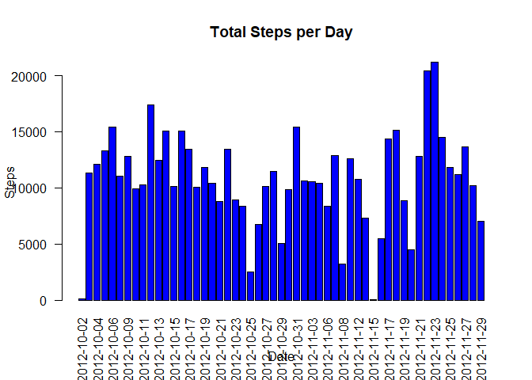
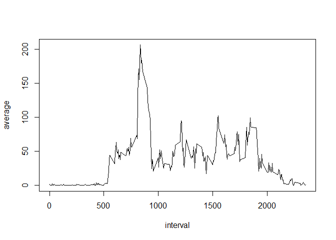
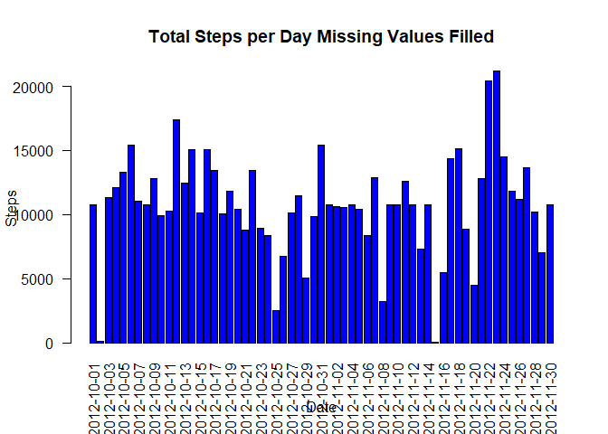
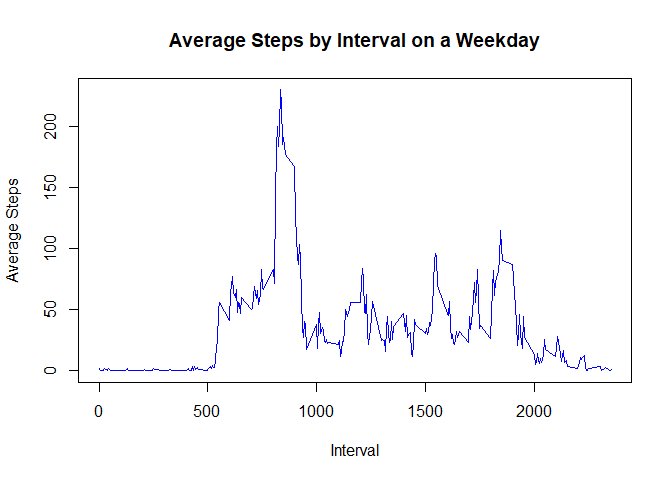
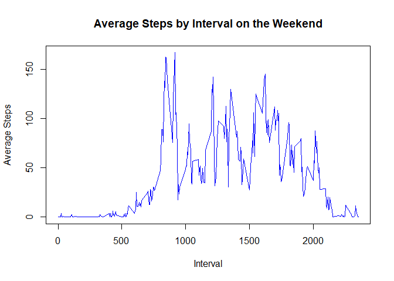

## Loading and preprocessing the data

``` r
df <- read.csv("activity.csv")
```

## What is mean total number of steps taken per day?

``` r
df_by_day <- aggregate(steps ~ date, data = df, FUN = sum)
barplot(df_by_day$steps, names.arg = df_by_day$date, xlab = "Date", ylab = "Steps", main = "Total Steps per Day", col = "blue", las = 2)
```

<!-- -->

``` r
print(sprintf("mean steps per day: %f", mean(df_by_day$steps)))
```

```
## [1] "mean steps per day: 10766.188679"
```

``` r
print(sprintf("median steps per day: %f", median(df_by_day$steps)))
```

```
## [1] "median steps per day: 10765.000000"
```


## What is the average daily activity pattern?


``` r
df_by_interval <- aggregate(steps ~ interval, data = df, FUN = mean)
plot(df_by_interval$interval, df_by_interval$steps, type = "l", xlab = "interval", ylab = "average")
```

<!-- -->

``` r
max_step_interval <- df_by_interval[df_by_interval$steps == max(df_by_interval$steps), ]$interval
print(sprintf("Interval with the most average steps per day: %.0f", max_step_interval))
```

```
## [1] "Interval with the most average steps per day: 835"
```

``` r
print(sprintf("(Or the interval beginning at %.0f hours and %.0f minutes", max_step_interval / 100, max_step_interval %% 100))
```

```
## [1] "(Or the interval beginning at 8 hours and 35 minutes"
```


## Imputing missing values


``` r
df_incomplete <- df[!complete.cases(df), ]
print(sprintf("The number of missing values (Rows with NAs) are %.0f", dim(df_incomplete)[1]))
```

```
## [1] "The number of missing values (Rows with NAs) are 2304"
```

``` r
# Fill in data with the mean for the interval
df_filled <- df
mean_steps <- tapply(df_filled$steps, df_filled$interval, mean, na.rm = TRUE)
for (i in seq_along(df_filled$steps)) {
        if (is.na(df_filled$steps[i])) {
                df_filled$steps[i] <- mean_steps[as.character(df_filled$interval[i])]
        }
}
df_by_day_filled <- aggregate(steps ~ date, data = df_filled, FUN = sum)
barplot(df_by_day_filled$steps, names.arg = df_by_day_filled$date, xlab = "Date", ylab = "Steps", main = "Total Steps per Day Missing Values Filled", col = "blue", las = 2)
```

<!-- -->

``` r
print(sprintf("mean steps per day: %f", mean(df_by_day_filled$steps)))
```

```
## [1] "mean steps per day: 10766.188679"
```

``` r
print(sprintf("median steps per day: %f", median(df_by_day_filled$steps)))
```

```
## [1] "median steps per day: 10766.188679"
```


## Are there differences in activity patterns between weekdays and weekends?


``` r
df_filled$date <- as.Date(df$date)
df_filled$dayType <- factor(ifelse(weekdays(df_filled$date) %in% c("Saturday", "Sunday"), "weekend", "weekday"))
# Calculate the average steps by interval and weekend
avg_steps <- aggregate(steps ~ interval + dayType, data = df_filled, FUN = mean)

avg_steps_weekday <- avg_steps[avg_steps$dayType == "weekday", ]
avg_steps_weekend <- avg_steps[avg_steps$dayType == "weekend", ]

plot(avg_steps_weekday$interval, avg_steps_weekday$steps, type = "l", col = "blue",
     xlab = "Interval", ylab = "Average Steps", main = "Average Steps by Interval on a Weekday")
```

<!-- -->

``` r
 # lines(avg_steps_weekend$interval, avg_steps_weekend$steps, col = "red")
 # legend("topright", legend = c("Weekday", "Weekend"), col = c("blue", "red"), lty = 1)
plot(avg_steps_weekend$interval, avg_steps_weekend$steps, type = "l", col = "blue",
     xlab = "Interval", ylab = "Average Steps", main = "Average Steps by Interval on the Weekend")
```

<!-- -->

